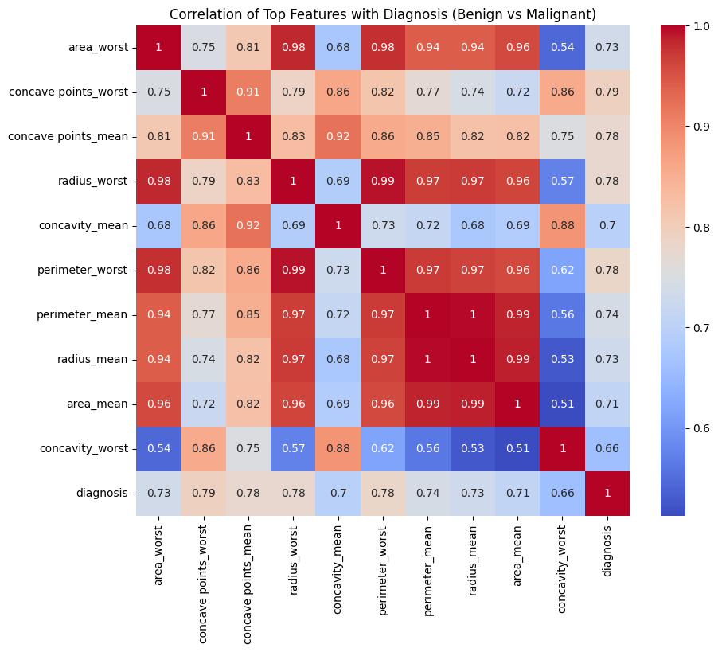
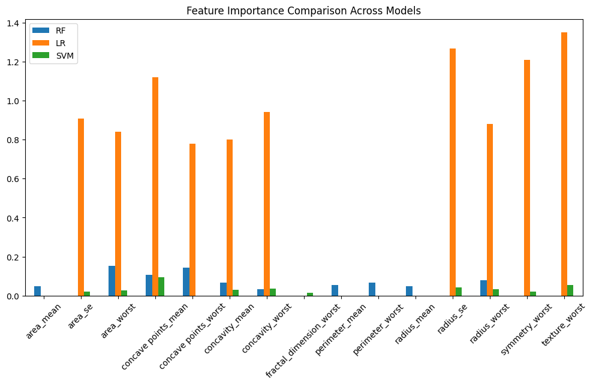
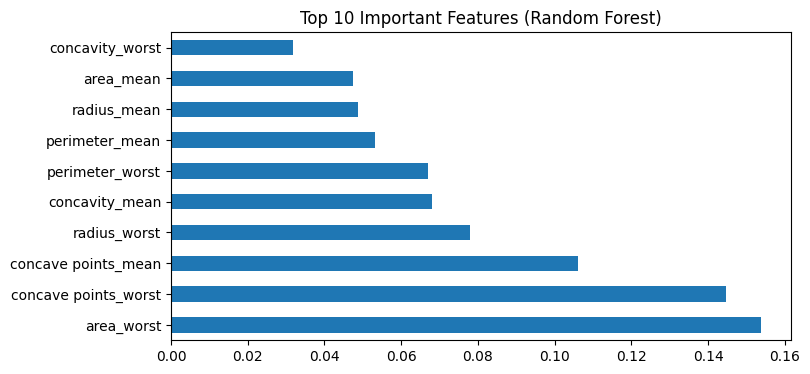
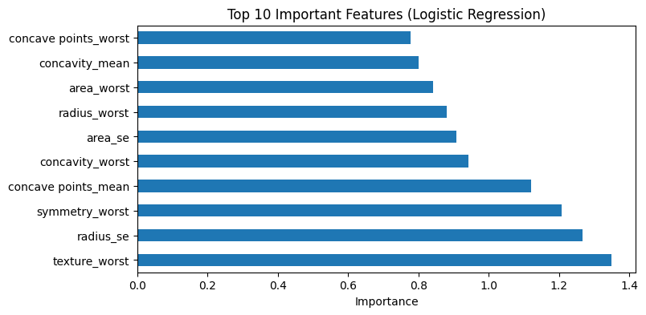
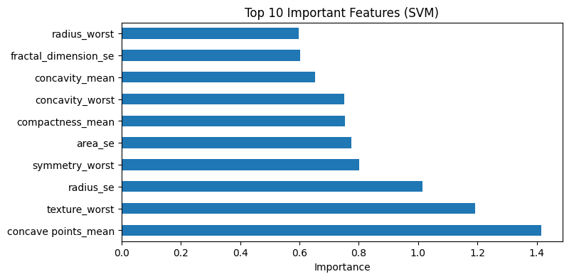
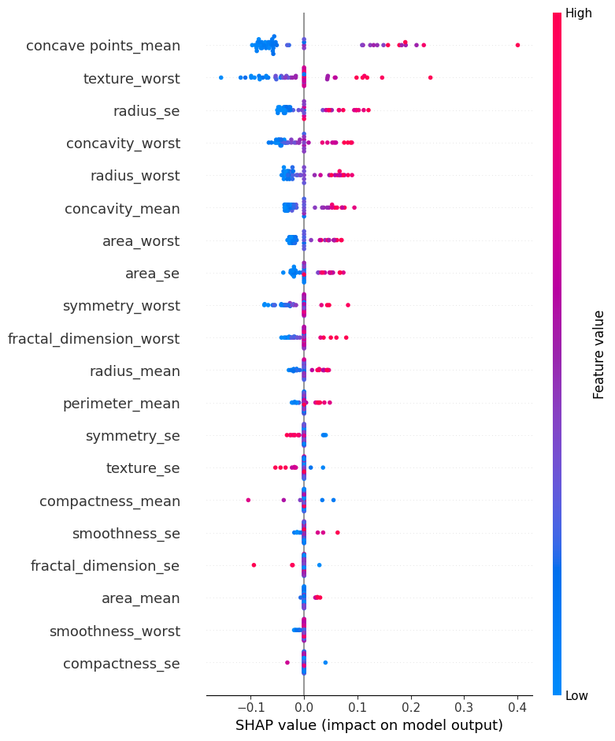
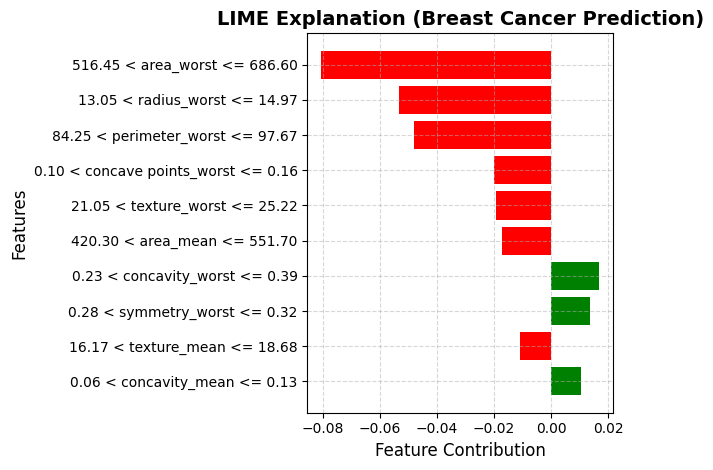
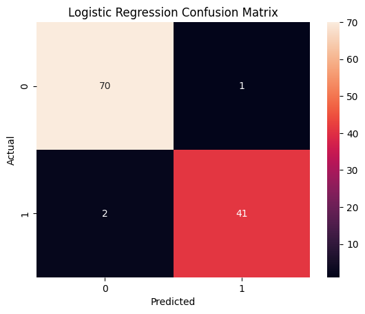
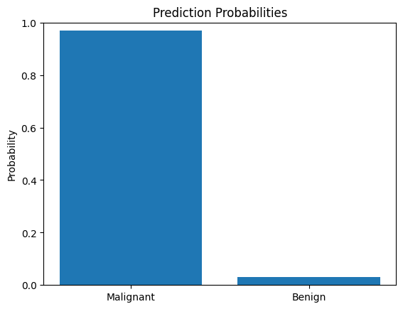

# A Data Science–Driven Study of Feature Influence Using Machine Learning and Explainable AI

## Overview

This project presents a comprehensive framework for analyzing feature influence in machine learning models using Explainable AI (XAI) techniques. It employs multiple machine learning algorithms to evaluate predictive performance while leveraging SHAP (SHapley Additive Explanations) and LIME (Local Interpretable Model-Agnostic Explanations) to interpret model predictions and identify the most influential features. The project demonstrates how Explainable AI enhances transparency, interpretability, and trust in machine learning models.

---

## Features

- Data preprocessing and feature engineering
- Correlation analysis
- Machine learning model training and evaluation
- Model performance comparison
- Feature importance analysis
- Explainable AI using SHAP
- Local prediction explanations using LIME
- Prediction probability visualization

---

## Technologies Used

- Python
- Jupyter Notebook
- Pandas
- NumPy
- Scikit-learn
- Matplotlib
- Seaborn
- SHAP
- LIME

---

## Project Structure

```text
Feature-Influence-Using-ML-Techniques/
│── Feature_influence_using_ML_techniques.ipynb
│── README.md
│── requirements.txt
│── .gitignore
│── correlation_heatmap.png
│── model_comparison_3.png
│── Important_features_RF.png
│── important_features_LR.png
│── important_features_SVM.png
│── confusion_matrix_1.png
│── shap_explanation.png
│── lime_explanation.png
│── prediction_probabilities.png
```

---

# Results

## Correlation Heatmap



---

## Model Comparison



---

## Random Forest Feature Importance



---

## Logistic Regression Feature Importance



---

## Support Vector Machine Feature Importance



---

## SHAP Explanation



---

## LIME Explanation



---

## Confusion Matrix



---

## Prediction Probabilities



---

## Future Improvements

- Extend support for additional Explainable AI techniques.
- Evaluate more machine learning algorithms and ensemble methods.
- Develop an interactive dashboard for model interpretation.
- Automate hyperparameter tuning for improved performance.
- Deploy the framework as a web-based application.

---

## Author

**Sowmya**
